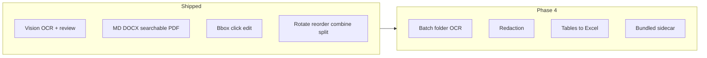
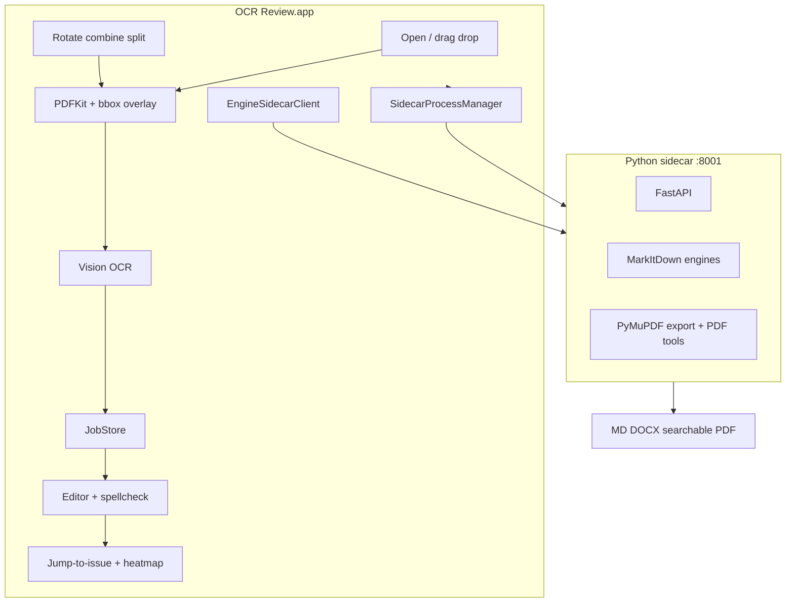

# OCR Review — Product & Engineering Plan

**Document version:** 1.0  
**Last updated:** May 29, 2026  
**Status:** Phases 0–3 complete · Phase 4 in progress · Performance + design-system overhaul shipped

> **Vision:** A native Mac app with an Adobe Acrobat Pro–inspired workflow: open a scanned PDF or image, run OCR, **review and correct** recognized text beside the source page, then export to Markdown, Word, or searchable PDF. Human-in-the-loop accuracy, local-first, no subscription.

**Target platform:** macOS 14+ (Sonoma), Apple Silicon + Intel  
**Target users:** Mac users who receive scanned PDFs or photos and need editable, trustworthy text without Acrobat.

**Non-goals:** iOS/iPad, Windows, true in-PDF text reflow (Acrobat’s hardest edit feature), e-signatures, cloud accounts, real-time collaboration.

---

## Table of Contents

1. [Executive Summary](#1-executive-summary)
2. [Why Native macOS](#2-why-native-macos)
3. [Adobe Workflow We Are Emulating](#3-adobe-workflow-we-are-emulating)
4. [What Exists Today](#4-what-exists-today)
5. [Acrobat Pro Feature Parity](#5-acrobat-pro-feature-parity)
6. [Product Principles](#6-product-principles)
7. [System Architecture](#7-system-architecture)
8. [OCR Engine Strategy](#8-ocr-engine-strategy)
9. [Data Model](#9-data-model)
10. [macOS App Design](#10-macos-app-design)
11. [Python Engine Sidecar](#11-python-engine-sidecar)
12. [Phased Roadmap](#12-phased-roadmap)
13. [Testing & Quality](#13-testing--quality)
14. [Open Questions](#14-open-questions)

---

## 1. Executive Summary

The product ships as a native macOS app (**OCR Review**) built with **SwiftUI**, **PDFKit**, and **Apple Vision** for on-device OCR with confidence scores and bounding boxes.

The **Python / MarkItDown** stack (`api/`) is a **local engine sidecar** (auto-started on app launch) for advanced conversion: Azure Doc Intelligence, PyMuPDF4LLM, LLM OCR plugin, searchable PDF export, DOCX export, and PDF combine/split APIs.

**Shipped today:**

- Open PDF/image (⌘O or drag & drop) → lazy Vision OCR per page → split-pane review
- Pro review workflow: jump-to-issue (⌥↓/⌥↑), confidence heatmap (⌘⌥H), spellcheck suggestions, revert to OCR
- Click-to-edit regions (Vision bbox overlay)
- Find & replace (⌘F) across all OCR'd pages
- Export Markdown, Word (.docx), searchable PDF
- Page tools: rotate, delete, reorder, append/combine/split PDF
- Settings: engine picker, sidecar health, project path
- App icon, code signing, Release build (`make mac-release`)
- **Command palette (⌘K)** — fuzzy launcher for every action
- **Export** also to Plain Text (.txt) and Rich Text (.rtf); Copy page / all text
- **Basic redaction** — black out a region; text stripped from all exports incl. searchable PDF
- **Zoom & fit** controls (⌘+ / ⌘- / ⌘0 / ⌘1) on the page view

**Performance (this release — the 10× pass):**

- Debounced, off-main-thread autosave — previously a full-document JSON re-encode + synchronous disk write ran on *every keystroke*; now coalesced and written on a background queue
- Reuse the in-memory `PDFDocument` for OCR — previously the whole PDF was re-parsed from disk on every page render and prefetch
- Parallel **Recognize All** via a bounded worker pool (Apple Vision, one PDF handle per worker)
- Cached, async PDF thumbnails (`ThumbnailCache`) — smooth scrolling on 400+ page documents

**Design (this release):** New design system (`Design/Theme.swift` + `Design/Components.swift`) — color / spacing / typography / elevation / motion tokens plus reusable button styles, pills, cards, status dots, keycaps. Redesigned welcome, workspace toolbar, editor, thumbnail strip, find bar, and settings; refined rounded confidence overlay; an **indigo brand accent kept distinct from the red→amber→green confidence palette**.

**Next (Phase 4):** Batch folder OCR, tables → Excel, compare documents, bundled sidecar venv.

---

## 2. Why Native macOS

| Capability | Web app | Native macOS |
|------------|---------|--------------|
| PDF page display | Render PNG server-side | **PDFKit** — instant, zoom, native |
| On-device OCR | Needs Python/cloud | **Vision** — free, offline, confidence |
| File open/save | Upload/download | **NSOpenPanel / NSSavePanel** |
| Menu bar & shortcuts | Limited | Full Mac menus (⌘O, ⌘R, ⌘F, ⌥↓, …) |
| Spellcheck | Browser API | **NSSpellChecker** — system dictionaries |
| Sandboxing & privacy | Browser limits | Hardened runtime + entitlements |
| Adobe-like feel | Good | **Better** — split views, toolbars, drag & drop |

The React web UI (`web/`) remains for **API development** only.

---

## 3. Adobe Workflow We Are Emulating

| Adobe Acrobat Pro step | OCR Review | Status |
|------------------------|------------|--------|
| File → Open | ⌘O or drag & drop — PDF, PNG, JPG, TIFF | ✅ |
| Scan & OCR → Recognize Text | Recognize This Page / All Pages… | ✅ lazy per-page + prefetch |
| Page view + text | Split view: PDFKit + editor | ✅ |
| Fix OCR errors | Edit panel; suspect spans; spellcheck | ✅ |
| Jump to suspect text | ⌥↓/⌥↑ issue navigation; heatmap | ✅ |
| Export Word / text | Export Markdown + Word (.docx) | ✅ |
| Searchable PDF | Embed OCR text layer via sidecar | ✅ |
| Find / replace | ⌘F cross-page on edited text | ✅ |
| Click text on page to edit | Bbox overlay (Vision) | ✅ |
| Organize pages | Rotate, delete, reorder, append, combine, split | ✅ |
| Batch processing | Folder queue | Phase 4 |
| Redaction | Black boxes + strip OCR text | Phase 4 |

---

## 4. What Exists Today

### macOS app (`mac/OCRReview/`)

| Capability | Notes |
|------------|-------|
| **Open** | NSOpenPanel + drag & drop anywhere in window |
| **PDFKit viewer** | Single-page view; thumbnail strip (LazyHStack, 400+ pages) |
| **Apple Vision OCR** | Per-page on demand; Recognize All; next-page background prefetch |
| **Sidecar OCR** | Azure, PyMuPDF4LLM, LLM, builtin via Settings engine picker |
| **Split-pane review** | PDF left, editable text right |
| **Click-to-edit regions** | Vision bbox overlay; select block → edit in pane |
| **Jump-to-issue review** | ⌥↓/⌥↑; `N to review` / `All clear` counter |
| **Confidence heatmap** | ⌘⌥H — regions colored red → amber → green |
| **Spellcheck suggestions** | NSSpellChecker on suspect/selected blocks; one-click fix |
| **Revert to OCR** | Per-region or per-page; original text preserved in model |
| **Suspect spans** | Low-confidence chips (confidence &lt; 0.85); click to select on page |
| **Find & replace** | ⌘F bar; Next/Previous; Replace / Replace All across pages |
| **Page jump + OCR progress** | `OCR 3/468` indicator |
| **Page tools** | Rotate, delete, reorder (drag thumbnails), append/combine/split PDF |
| **Export Markdown** | ⌘⇧E |
| **Export Word (.docx)** | ⌘⌥E via sidecar |
| **Export searchable PDF** | Sidecar + PyMuPDF invisible text layer |
| **Recent documents** | JobStore JSON in Application Support |
| **Settings** | Engine picker, sidecar URL, project path, health, Restart |
| **Sidecar auto-start** | Spawns `uv run uvicorn` on launch from `~/markitdown-app` |
| **App icon + signing** | Asset catalog; `make mac-release DEVELOPMENT_TEAM=…` |

### Python sidecar (`api/`)

| Endpoint | Purpose |
|----------|---------|
| `GET /health` | Sidecar health check |
| `GET /v1/engines` | List engines + availability |
| `POST /v1/convert` | One-shot MarkItDown convert |
| `POST /v1/export/searchable-pdf` | PDF/image + OCR JSON → searchable PDF |
| `POST /v1/export/docx` | OCR JSON → Word document |
| `POST /v1/pdf/combine` | Merge multiple PDFs |
| `POST /v1/pdf/split` | Extract page range to new PDF |

| Concern | Detail |
|---------|--------|
| Engines | builtin, PyMuPDF4LLM, Azure Doc Intelligence, LLM OCR plugin |
| Multipart limit | 100 MB per part (fixes Starlette 1 MB default for large PDF export) |
| Web dev UI | `web/` on :5174 |

### Tests

21 pytest tests covering engines, convert, searchable PDF export (including &gt;1 MB uploads and redaction), DOCX export, PDF combine/split.

---

## 5. Acrobat Pro Feature Parity

Feature map for building toward Acrobat Pro **without** copying its full scope.

### 5.1 Shipped (Acrobat overlap)

| Acrobat Pro | OCR Review |
|-------------|------------|
| Recognize Text (OCR) | Apple Vision (default) + sidecar engines |
| Review / correct OCR | Split pane + edit panel + spellcheck |
| Suspect / low-quality text | Confidence chips + heatmap + jump-to-issue |
| Export text | Markdown + Word |
| Searchable PDF | PyMuPDF sidecar |
| Find / replace | ⌘F cross-page |
| Click region → edit | Vision bbox overlay |
| Organize pages | Rotate, delete, reorder, append, combine, split |
| Engine settings | Settings → Vision / Azure / PyMuPDF / LLM |

### 5.2 Remaining — high value

| Feature | Acrobat equivalent | Priority |
|---------|-------------------|----------|
| **Redaction** | Redact text & images | ✅ shipped (basic) |
| **Batch folder OCR** | Action Wizard | P0 |
| **Tables → Excel** | Export to spreadsheet | P1 |
| **Reading order fix** | Reading Order tool | P2 |
| **Export plain text / RTF** | Save as other formats | P2 |
| **Compare documents** | Compare Files | P2 |
| **Bundled sidecar venv** | No Terminal / uv required | P2 |

### 5.3 Poor fit — do not build

| Acrobat Pro feature | Why skip |
|---------------------|----------|
| Fill & sign / e-signatures | Different product (DocuSign) |
| True Edit PDF reflow | Defer indefinitely |
| Preflight / print production | Print-industry tooling |
| Live cloud review / comments sync | Needs backend + accounts |

### 5.4 Engine mapping by task

| Task | Best engine |
|------|-------------|
| Fast local OCR + review | **Apple Vision** (default) |
| Hard scans, tables, forms | **Azure Document Intelligence** |
| Searchable PDF text layer | **PyMuPDF** sidecar |
| Structured Markdown | **PyMuPDF4LLM** |
| Figures inside scans | **LLM OCR plugin** |

### 5.5 Priority stack (remaining)

1. ~~Redaction (basic)~~ ✅ shipped  
2. Batch folder OCR  
3. Tables → Excel  
4. Bundled sidecar venv (no `uv` / Terminal)  
5. Compare documents  



---

## 6. Product Principles

1. **Native first** — Feels like a Mac app (menus, shortcuts, split views, drag & drop).
2. **Review before export** — OCR is a draft; user confirms or fixes.
3. **Offline by default** — Vision OCR works without network.
4. **Advanced engines optional** — Azure / LLM via Python sidecar when configured.
5. **No subscription** — Local files, local storage.
6. **Large documents** — Lazy per-page OCR; never block UI on 400+ page books.
7. **Non-destructive editing** — Original OCR text preserved; revert anytime.

---

## 7. System Architecture



**Project layout:**

```
markitdown-app/
├── mac/
│   ├── OCRReview/              # SwiftUI app
│   │   ├── Views/              # ReviewWorkspace, PDF overlay, spellcheck, …
│   │   ├── ViewModels/         # DocumentViewModel
│   │   ├── Services/           # Vision, sidecar, export, spellcheck, PDF tools
│   │   ├── Models/             # OCRDocument, OCRPage, OCRBlock
│   │   └── Assets.xcassets/    # App icon
│   ├── design/                 # app-icon-1024.png source
│   ├── scripts/                # generate_icons.sh
│   └── project.yml             # XcodeGen
├── api/markitdown_api/         # FastAPI sidecar
├── web/                        # React dev UI (:5174)
├── tests/                      # pytest (19 tests)
├── Makefile
├── plan.md
└── README.md
```

---

## 8. OCR Engine Strategy

### 8.1 Primary — Apple Vision

Free, offline, per-line confidence and bounding boxes. Default for all users. Lazy per-page OCR with next-page prefetch for large PDFs.

### 8.2 Secondary — Python sidecar

| Engine | Use case |
|--------|----------|
| **Apple Vision** | Default; bbox overlay; offline |
| **Azure Doc Intelligence** | Hard scans, tables, forms |
| **PyMuPDF4LLM** | Structured Markdown |
| **LLM OCR plugin** | Embedded images in scans |
| **builtin** | Text-based PDF extraction |

### 8.3 Settings → OCR Engine

| Option | Requires |
|--------|----------|
| Apple Vision (default) | Nothing |
| PyMuPDF4LLM / builtin | Sidecar running |
| Azure | Sidecar + `MARKITDOWN_DOCINTEL_*` in `.env` |
| LLM OCR | Sidecar + `MARKITDOWN_LLM_*` in `.env` |

Sidecar auto-starts from `~/markitdown-app` (override path in Settings). Manual fallback: `make api`.

---

## 9. Data Model

Stored in `~/Library/Application Support/OCRReview/jobs/`:

```json
{
  "id": "uuid",
  "filename": "FIDIC.pdf",
  "engine": "vision",
  "total_page_count": 129,
  "source_path": "/Users/.../FIDIC.pdf",
  "pages": [
    {
      "page_number": 9,
      "ocr_text": "...",
      "edited_text": "...",
      "blocks": [
        {
          "text": "...",
          "confidence": 0.72,
          "bbox_normalized": [0.1, 0.8, 0.3, 0.05],
          "original_text": "..."
        }
      ]
    }
  ]
}
```

| Field | Meaning |
|-------|---------|
| `total_page_count` | PDF page count (may exceed OCR'd pages) |
| `edited_text` | User corrections; wins on export |
| `original_text` (block) | Preserved for revert |
| `bbox_normalized` | Vision coords [minX, minY, width, height], origin bottom-left |

**Export rules:**

- Uses `edited_text` when present, else `ocr_text`
- Searchable PDF / DOCX: only **OCR'd pages** included
- Modified PDF (rotate/reorder/delete): temp copy used for searchable export

---

## 10. macOS App Design

### 10.1 Screens

1. **Welcome / Recents** — Open, drag & drop hint, recent jobs  
2. **Review workspace** — PDF + bbox overlay + editor + thumbnails + review HUD  
3. **Settings** — Engine, sidecar URL, project path, health, Restart  

### 10.2 Keyboard shortcuts

| Action | Shortcut |
|--------|----------|
| Command palette | ⌘K |
| Open | ⌘O |
| Recognize this page | ⌘R |
| Find | ⌘F |
| Export Markdown | ⌘⇧E |
| Export Word | ⌘⌥E |
| Confidence heatmap | ⌘⌥H |
| Next issue | ⌥↓ |
| Previous issue | ⌥↑ |
| Zoom in / out | ⌘+ / ⌘- |
| Fit to window / actual size | ⌘0 / ⌘1 |
| Previous / next page | ← / → |

### 10.3 Menus

| Menu | Items |
|------|-------|
| **OCR** | Recognize, Export Markdown / Word / Searchable PDF |
| **Review** | Next/Previous issue, heatmap, revert page |
| **Pages** | Rotate, append/combine/split, delete |

---

## 11. Python Engine Sidecar

| Concern | Approach |
|---------|----------|
| Dev | `make api` → `:8001` |
| Auto-start | `SidecarProcessManager` on app launch |
| Health | `GET /health`; Settings shows status + Restart |
| Multipart uploads | 100 MB part limit (`multipart_limits.py`) |
| Large PDF export | Fixed Starlette 1 MB default (was blocking FIDIC-scale PDFs) |
| Ship (future) | Bundle venv inside `.app` |

**Environment** (`.env` in repo root):

```bash
MARKITDOWN_DOCINTEL_ENDPOINT=...
MARKITDOWN_AZURE_API_KEY=...
MARKITDOWN_LLM_BASE_URL=...
MARKITDOWN_LLM_API_KEY=...
MARKITDOWN_LLM_MODEL=...
```

---

## 12. Phased Roadmap

### Phase 0 — Foundation ✅

- [x] MarkItDown Python API + engines  
- [x] Web converter (dev tool)  

### Phase 1 — macOS MVP ✅

- [x] XcodeGen project, PDFKit viewer, Vision OCR  
- [x] Split-pane review, suspect spans, export Markdown  
- [x] Lazy per-page OCR, page jump, scrollable thumbnails (400+ pages)  
- [x] Recents, `make mac`  

### Phase 2 — Export like Acrobat ✅

- [x] Searchable PDF export (`POST /v1/export/searchable-pdf`)  
- [x] Export DOCX (`POST /v1/export/docx`, ⌘⌥E)  
- [x] Find in document (⌘F)  
- [x] Find & replace across pages  
- [x] Settings: engine picker + sidecar health  
- [x] `EngineSidecarClient` wired (export + sidecar OCR)  
- [x] App icon + code signing (`make mac-release`)  
- [x] Multipart upload fix for large PDFs (100 MB)  

### Phase 3 — Edit & organize lite ✅

- [x] Bbox overlay — click region → edit block  
- [x] Rotate / delete / reorder pages  
- [x] Combine & split PDF (native PDFKit + sidecar API)  
- [x] Auto-start Python sidecar on launch  
- [x] Jump-to-issue review + confidence heatmap  
- [x] Spellcheck suggestions on suspect blocks  
- [x] Revert region/page to original OCR  
- [x] Drag & drop to open  
- [x] Redaction (basic) — black box + text stripped from exports  

### Phase 4 — Pro workflows (next)

- [ ] Batch folder OCR  
- [ ] Tables → Excel  
- [ ] Compare documents  
- [ ] Form field extraction (Azure)  
- [ ] Bundled sidecar venv (no Terminal)  
- [ ] Mac App Store distribution  

---

## 13. Testing & Quality

| Layer | Approach | Status |
|-------|----------|--------|
| API engines | `tests/test_markitdown_api.py` | ✅ |
| Searchable PDF | Unit + endpoint; &gt;1 MB multipart | ✅ |
| DOCX export | `tests/test_docx_export.py` | ✅ |
| PDF combine/split | `tests/test_pdf_tools.py` | ✅ |
| Redaction export | `tests/test_redaction_export.py` — text excluded + black box | ✅ |
| macOS | Manual: FIDIC 129-page PDF, export, review workflow | ✅ |
| Vision OCR | Fixture pages; assert key strings | Planned |
| Batch | Folder of 3 PDFs completes | Phase 4 |

**Quality bars (met):**

- 5-page scan → fix OCR → searchable PDF searchable in Preview + DOCX opens in Word  
- 129-page PDF → export searchable PDF without 1024 KB multipart error  
- ⌥↓ walks all low-confidence regions; spellcheck fixes suspect words  

---

## 14. Open Questions

1. **App name for ship?** OCR Review · ScanEdit · MarkItDown Editor  
2. **Monetization?** Free + sidecar optional vs paid Pro tier for batch/Azure  
3. **Bundled sidecar venv?** Ship inside `.app` vs require `uv` + `~/markitdown-app`  
4. **Redaction legal disclaimer?** Required before shipping redact feature  
5. **Retire web UI?** Keep for API dev only  
6. **Partial OCR export warning?** Explicit dialog when `ocrPageCount < totalPageCount` on searchable export  

---

## Appendix A: Makefile targets

```bash
make install          # uv sync (Python 3.12)
make api              # Python sidecar :8001
make test             # pytest (21 tests)
make mac-gen          # xcodegen
make mac              # open Xcode
make mac-icons        # regenerate AppIcon from design/app-icon-1024.png
make mac-release      # Release build (DEVELOPMENT_TEAM=… optional)
make mac-install      # copy Release app to /Applications
make web              # React dev UI :5174
```

---

## Appendix B: How to run

```bash
cd ~/markitdown-app
make install          # once
make mac-release    # build signed app
open mac/build/Build/Products/Release/OCR\ Review.app
```

Sidecar starts automatically. Override project path in **OCR Review → Settings** if not at `~/markitdown-app`.

Manual sidecar:

```bash
make api            # http://127.0.0.1:8001
```

---

## Appendix C: Known issues & fixes

| Issue | Cause | Fix |
|-------|-------|-----|
| `Part exceeded maximum size of 1024KB` on export | Starlette 1 MB multipart default | `multipart_limits.py` → 100 MB; restart sidecar |
| Only ~15 thumbnails visible | LazyHStack viewport | Scroll horizontally — all pages exist |
| Sidecar engines unavailable | Sidecar not running / missing `.env` | Settings → Restart; check project path |

---

## Appendix D: Reference

F&O Copilot iOS (`fo-ai-copilot/apps/ios/`) uses a similar SwiftUI + XcodeGen + local API pattern. OCR Review adds native Vision OCR, PDFKit bbox overlay, and Acrobat-style review workflow instead of remote JSON APIs.
